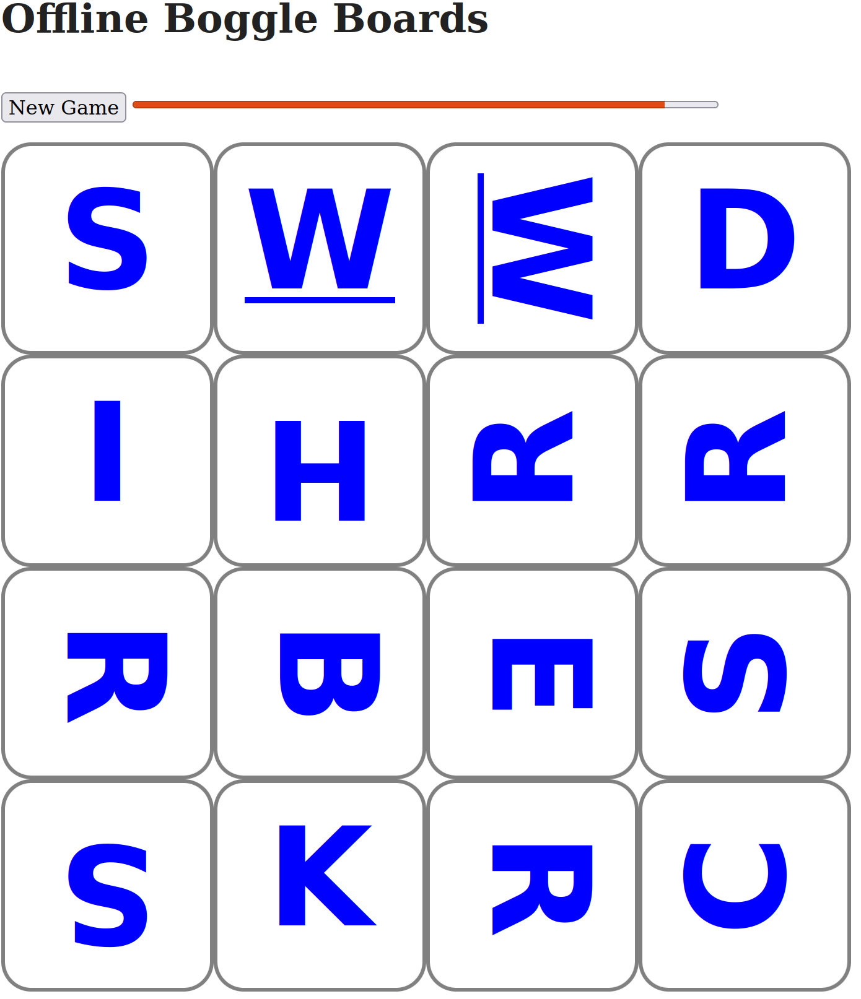

# Offline Boggle Boards

This project is the answer to the question, "What's the easiest way to play Boggle on a flight?", but being frustrated that options in the app store all are ad laden.

If you load this app on your laptop while online, it will continue to work without Internet connectivity. Mobile phone support coming soon!

## Using

The easiest way to use this is to go to [the website](https://mrjones-plip.github.io/offline-boggle-boards/) and then just keep the page open.

You can also download this repo and open the `index.html` page.

After the page is loaded, you provide the 3-minute timer, paper and writing utensils.  When you're ready to play a new game, click the "New Game" button.

## Outstanding features

* [X] add timer
* [X] mobile support
* [ ] fix font sizing/centering
* [ ] enable pause
* [ ] ability to generate a page full of boards for printing/saving as PDF

## Thanks

I got the idea from [Jim's Boggle Board Generator Perl App](http://xuth.net/programming/bog_cgi/).  Thanks Jim!

